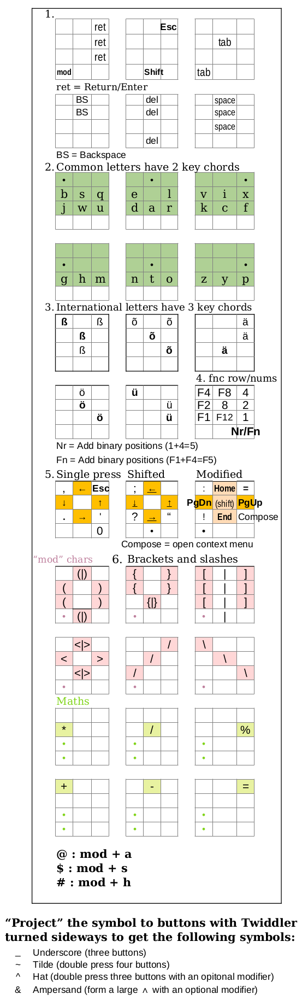

# Design principles (ideas behind it)

Plan the design according to usage of computer and smart device. Basics (navigation keys) will get mapped to be directly accessible.

## Intuitivity

The biggest hurdle to Twiddler mass-adoption is the initial learning curve of the layout. Intuitively, to facilitate mass-adoption, we could pick the approach of minimizing fustration for early users. The key to rentation thereafter is the customization of the layout according to the usage pattern. In my experience, each customization I made gave me an endorphine rush.

### Fustration

To minimize fustration, we may choose to alleviate pressing of unwanted chords and buttons by leaving the easy-to-fumble combinations (1KCs) void of effect. Another approach is to map something of 'safe' effect, such as ESC, tab, arrows. Because this is a navigation-oriented conf, we'll go with that. Hopefully fumbling will lessen as the user experience increases.

# Mouse

[Mouse keys can be repurposed as one-key chord keys](https://github.com/lancegatlin/typemax/blob/master/basic_layout_design.md). Modifier keys have no effect on them.
However uncomfortable the 8-direction switch mouse is, it is a built-in companion to the keyer. Therefore we keep mouse keys as mouse keys. For precision or speedy mousing, a dedicated mouse is needed.

With the current version of Twiddler 3, it is not possible to map wheel events. We will have to settle with PgUp and PgDn.

# Keys

## Design for navi

All navi keys should be placed so that their position matches their meaning.

1. Most importantly  
    - Esc

1. Shift (see _Edit mode design architecture_ point 1)

1. Opening a program  
    Open the prompt for opening a program: 'run' menu (Alt+F2)

1. Using a file manager  
    Oftentimes I need to navigate to a file to open.  
    ← → ↑ ↓ TAB BSpc Enter Compose (right-click menu)

1. Usisng a browser  
    Often the only program I use is the web browser. Other times I use it intermittantly.  
    Needed for browsing webpages:
    - Ctrl+TAB
    - Ctrl+Shift+TAB
    - Ctrl+w
    - Ctrl+r
    - Ctrl+n

1. In a text editor
    - PgUp PgDn
    - Ctrl+c
    - Ctrl+f

## Design for text editing

<!-- In the twiddler row that has shift (pinky row), the two other buttons should not be used to produce anything that could be shifted. F.ex. Large ẞ is quite improbable. -->

1. Add shift.
Shift is frequently used and therefore useful to have as a modifier under the pinky finger. Moreover,  
    - Combination alt+shift can _not_ be achieved by thumb alone.  
    - Using thumb buttons slows down twiddling.

1. Add letters.

<!--
As a user of English, Estonian and German ‒ my letter frequencies will take into account the letter frequencies in each of these languages. Because in these quite different languages, the frequency ordering of n-grams will be quite different. Therefore, less is to be gained from assigning multi-character chords such as bigrams and trigrams (like TabSpace and BackSpice2 do).
-->

My use will be in English, German and Estonian. Finding a theoretical optimum for these three languages as a single layout is a daunting challenge. Moreover, the corpora of natural language (e.g. books, webpages) might not be representive for my use case of programming. I will just use an existing English chord mapping.

<!--
In a forum thread [Ergonomic considerations for the ring finger](https://forum.tekgear.com/t/ergonomic-considerations-for-the-ring-finger/872), the recommendation is made "to avoid strain, limit the frequency of chords which press buttons with both the middle finger and pinky, but not the ring finger."
-->

As we are intending to use shift under pinky for letters and navi keys alike, we map everything modifiable (e.g. letters) to the three other fingers.
Thankfully, @ben has created such a layout, called [Mirrorwalk](https://forum.tekgear.com/t/walking-layout/48). It uses 3 rows to represent all the letters in clever 2-button chords, so that when typing English, the next letter chord has 65% chance of being such that one of the fingers remains on the same button.

Creating an alternative mapping of letters according to Your use case is a very nice computer programming exercise to solve.

3. Add õ ä ö ü and ß for Estonian and German languages.

4. Add numbers

1. Add most frequent punctuation  
When writing regular text, some non-letter characters come in really handy  
    - , ;
    - . :
    - `'` "
    - !
    - ?
    - Space
    - Enter
    - Backspace
    - &
    - `-` (hyphen)
    - (
    - )

<!--

### Estonian

In Estonian language, there are commonly double letters to denote the long form pronounciation. In texts, the doublly occurring characters should be counted as one occurrence, because pressing the same keys twice is not much more difficult as pressing once. When optimizing for one language, this may make a bigger difference than then, when optimizing for 3 languages.

Source: http://www.eki.ee/corpus/stats1.html

- SPC	0,128
- A	0,101
- E	0,087
- I	0,081
- S	0,072
- T	0,060
- L	0,051
- U	0,046
- N	0,042
- K	0,038
- O	0,032
- D	0,031
- M	0,030
- R	0,029
- V	0,020
- P	0,016
- G	0,015
- J	0,014
- H	0,014
- ...
-->

<!--
### English

Source: https://norvig.com/mayzner.html

- E	12.49%
- T	9.28%
- A	8.04%
- O	7.64%
- I	7.57%
- N	7.23%
- S	6.51%
- R	6.28%
- H	5.05%
- L	4.07%
- D	3.82%
- C	3.34%
- U	2.73%
- M	2.51%
- F	2.40%
- P	2.14%
- G	1.87%
- W	1.68%
- Y	1.66%
- B	1.48%
- V	1.05%
- K	0.54%
- X	0.23%
- J	0.16%
- Q	0.12%
- Z	0.09%

Most infrequent letter in the beginning of the word (with the exception of Y, match the lowest frequent characters overall):
y v k x j q z -->

<!--
### German

Source and License: http://storage.googleapis.com/books/ngrams/books/20200217/ger/ger-1-ngrams_exports.html
-->

6. Add remaining punctuation  
These are not necessarily a part of inserting text.
    - []
    - { }
    - < >
    - `+` `-` =
    - `*` / % (modulo)
    - `` # ` ' ´ ? ~ ^``
    - | & \

1. Create chords for custom phrases
    As a "cherry on the cake", add chords for some of the frequently used words and longer constructs
    - frequently used keywords, types and constructs in your programming language
    - const
    - class template
    - while
    - string
    - vector
    - your address
    - your bank account number
